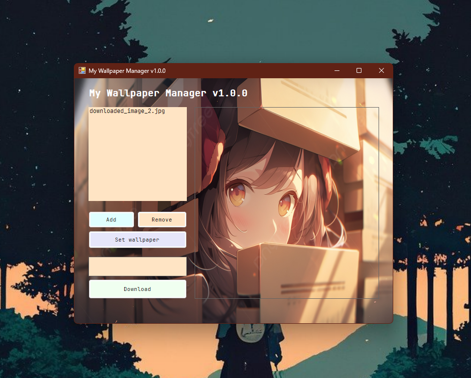
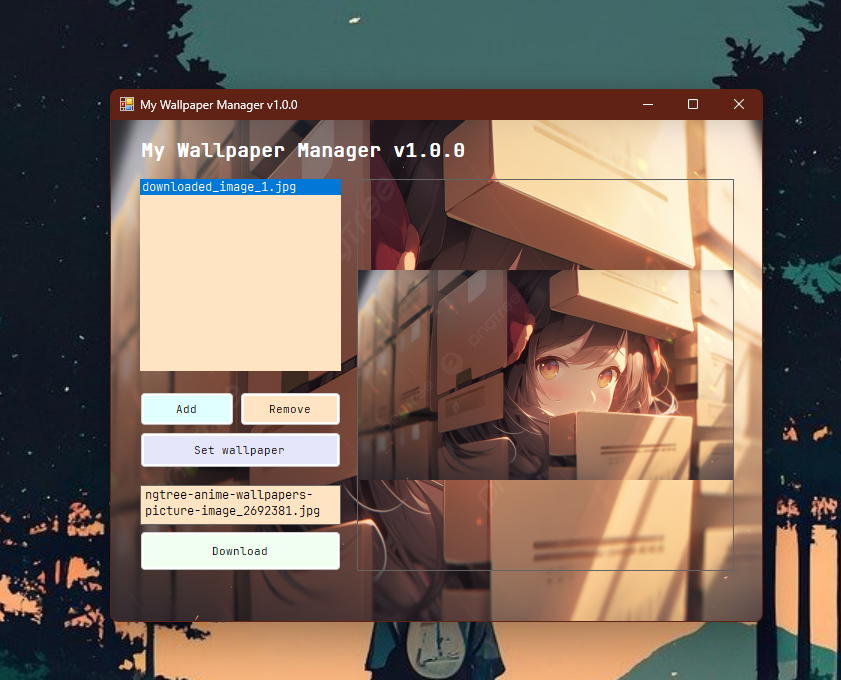

# My manager wallpaper ⛺

This is my first app using winforms and it is exciting as well as fun to see all the things you can do.

## Features

1. Save wallpapers in a more organized place in your operating system 🦦.
2. Download wallpapers with the link from the application 🐧.
3. The wallpapers you download are stored in the root path so you can access them whenever you want 🦜.
4. The path to the wallpaper as well as its type are saved in a simple text file 🐢.
5. Add and remove wallpapers whenever you want 🐿️.
6. Set wallpapers on your desktop 🐋.

## More features

New design UI?, Database implementation?, User configuration?, Coming soon 🐳.

## Preview

## Credits

Created by [alemndev](https://github.com/alemndev) with google help and listening [TWICE](https://twice.jype.com/) 🌿.
